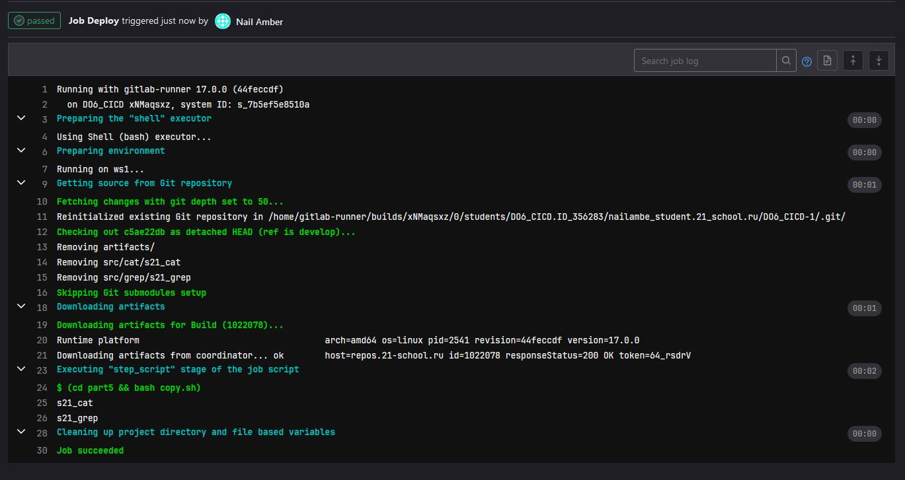

## Part 1. Setting up the **gitlab-runner**  
- Установим gitlab-runner на Ubuntu 22.04:
	- `curl -L "https://packages.gitlab.com/install/repositories/runner/gitlab-runner/script.deb.sh" | sudo bash`
	- `sudo apt-get install gitlab-runner`
- Run **gitlab-runner** and register it for use in the current project (_DO6_CICD_).

	-   You will need a URL and a token for runner registration, that can be obtained from the task page on the platform.
	- `sudo gitlab-runner start`
	- `sudo gitlab-runner register`
	-  Вводим наш адрес и токен
	-  Enter an executor `shell`
	- Видим что всё работает  
		
## Part 2. Building
-  Write a stage for **CI** to build applications from the _C2_SimpleBashUtils_ project.

	In the _gitlab-ci.yml_ file, add a stage to start the building via makefile from the _C2_ project.

	Save post-build files (artifacts) to a random directory with a 30-day retention period.
	- 
	- 
## Part 3. Codestyle test
- Write a stage for **CI** that runs a codestyle script (_clang-format_).

	If the codefile didn't pass, "fail" the pipeline.

	In the pipeline, display the output of the _clang-format_ utility.
	- 
	- 
	- 
## Part 4. Integration tests
- Write a stage for **CI** that runs your integration tests from the same project.

	Run this stage automatically only if the build and codestyle test passes successfully.

	If tests didn't pass, "fail" the pipeline.

	In the pipeline, display the output of the succeeded / failed integration tests.
	-   
	- 
## Part 5. Deployment stage
- Клонируем виртуальную машину
- Настраиваем сеть (между двумя серверами)
- Переходим в юзера gitlab-runner `su gitlab-runner` (На первом оригинальном сервере)
- На нём генерируем ключ ssh `ssh-keygen`
- Пробрасываем ключ второму серверу `ssh-copy-id nailambe@10.10.0.2`
- Даём gitlab-runner больше прав `sudo usermod -aG sudo gitlab-runner` (На первом оригинальном сервере)
- На втором сервере (склонированном) даём права к директории /usr/local/bin `chmod 777 /usr/local/bin`
- Настраиваем все файлы
  - 
  - 
  - 
## Part 6. Bonus. Notifications
- Set up notifications of successful/unsuccessful pipeline execution via bot named "[your nickname] DO6 CI/CD" in _Telegram_.

	-   The text of the notification must contain information on the successful passing of both **CI** and **CD** stages.
	-   The rest of the notification text may be arbitrary.
	-  `notify.sh`
		- 
	-  `.gitlab-ci.yml`
		- 
	-  Бот отправляет нам сообщения о успешном CICD:
		- 
